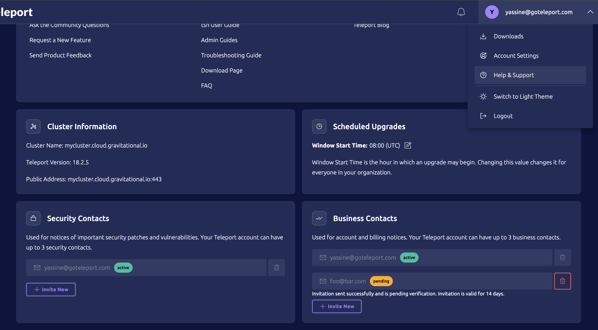

<FAQSection icon="questionCircle">
  ## General FAQ
</FAQSection>

### Can I use Teleport in production today?

Teleport has been deployed on server clusters with thousands of hosts at
Fortune 500 companies. It has been through several security audits from
nationally recognized technology security companies, so we are comfortable with
the stability of Teleport from a security perspective.

### Can I connect to nodes behind a firewall?

Yes, Teleport supports reverse SSH tunnels out of the box. To configure
behind-firewall clusters, see [Configure Trusted Clusters](zero-trust-access/management/trustedclusters.mdx).

### How is Teleport's Community Edition different from Enterprise?

Teleport provides two editions:

- Teleport Enterprise
- Teleport Community Edition

For a detailed breakdown of features by edition, alongside a description of the
products available to Teleport users, see [Teleport
Editions](./feature-matrix.mdx).

### Should we use Teleport Enterprise or Teleport Community Edition for connecting resources to our Teleport cluster?

(!docs/pages/includes/ent-vs-community-faq.mdx!)

### Can individual agents create reverse tunnels to the Proxy Service without creating a new cluster?

Yes. When running a Teleport Agent, use the `--auth-server` flag to point to the
Proxy Service address (this would be `public_addr` and `web_listen_addr` in your
file configuration). For more information, see
[Adding Nodes to the
Cluster](installation/agents/join-token.mdx).

### Can Nodes use a single port for reverse tunnels?

Yes, Teleport supports tunnel multiplexing on a single port. Set the
`tunnel_listen_addr` to use the same port as the `web_listen_addr` address
setting in the `proxy_service` configuration. Teleport will automatically use
multiplexing with that configuration.

### Can Teleport be deployed in agentless mode?

Yes. All Teleport services support agentless mode, where the service proxies
traffic to an upstream infrastructure resource not available on `localhost`.

With Teleport in agentless mode, you can easily control access to SSH servers,
Kubernetes clusters, desktops, databases, and internal applications without
running any additional software on your servers. Agentless mode supports session
recordings and audit logs for deep understanding into user behavior.

For capabilities such as kernel-level logging and user provisioning, we
recommend Teleport as a drop in replacement for OpenSSH. Since Teleport replaces
the OpenSSH agent while preserving OpenSSH's functionality, you get more
functionality without a net addition of an agent on your system.

### Can I use OpenSSH with a Teleport cluster?

Yes, this question comes up often and is related to the previous one. Take a
look at [Using OpenSSH Guide](enroll-resources/server-access/openssh/openssh-agentless.mdx).

### Can I copy files from one Teleport node to another?

Yes, Teleport supports node-to-node file transfers. Here is an example of copying from one 
SSH server to another.

```code
$ tsh scp bob@foo:/path/1.txt bob@bar:/path/2.txt
1.txt 100% |█████████████████████████████████████████████████████████████████| (779/779 B, 8.2 kB/s)
```

In addition Teleport supports [Headless Authentication](zero-trust-access/authentication/headless.mdx),
which allows you to perform operations like `tsh ssh` or `tsh scp` from remote systems where you
are not logged in to Teleport or may not have access to a browser to authenticate.

### `tsh` is very slow on Windows, what to do?

If your host machine is joined to an Active Directory domain, you might find
user lookups take a lot longer than you expect. If possible, we recommend
updating `tsh` to v18 or later, which contains an optimized user lookup
algorithm.

If upgrading is not possible, you can use environment variables to set default
account information for your Teleport user. If you are experiencing long lookup
times on Windows, do the following:

- Either set the `TELEPORT_USER` environment variable or set the `--user` flag to the name of your Teleport user.
- Either set the `TELEPORT_LOGIN` environment variable or set the `--login` flag to the name of current host user. This setting can be overridden if you open a new SSH session on a machine as a different user.
- Set the `TELEPORT_HOME` environment variable to be the home directory of your current host user + `\.tsh`. For example, if your home directory is `C:\Users\Me`, you'd set `TELEPORT_HOME` to `C:\Users\Me\.tsh`.

You can set these environment variables globally in Windows so that you don't have to set them every
time you run `tsh`.

### Which version of Teleport is supported?

See [Upcoming Releases](upcoming-releases.mdx) for the versions of Teleport that
we support and how long we plan to continue supporting them.

### Does the Web UI support copy and paste?

Yes. You can copy and paste using a mouse.

### What TCP ports does Teleport use?

Please refer to our [Networking](reference/deployment/networking.mdx) guide.

### Does Teleport support authentication via OIDC, SAML, or Active Directory?

Teleport offers this feature for the Enterprise (Cloud) and Enterprise
(Self-Hosted) versions of Teleport.

### Why do changes to a user's role set only take effect on the next login?

A Teleport user's assigned roles are embedded in the client certificate they
receive upon logging on. This certificate remains valid and can be used until
its expiry, even if the user's role set has changed.

To get a new certificate with the new role set, the user will need to log out
and log back in.

Revocation of Teleport access should be done with Teleport's
[session and identity locks](identity-governance/locking.mdx),
not by removing roles.

### Does Teleport support provisioning users via SCIM?

Teleport supports [SCIM](https://scim.cloud/) provisioning for Okta via the
hosted Okta integration, available in the Enterprise (Cloud) and Enterprise
(Self-Hosted) versions of Teleport.

Refer to the [hosted Okta integration guide](identity-governance/integrations/okta/okta.mdx)
for details on setting up and configuring SCIM support.

You can also set up Teleport to integrate with a SCIM provider to automatically
synchronize SCIM group memberships with Teleport Access Lists. For details, see
the [SCIM integration
documentation](identity-governance/integrations/scim/scim.mdx).

### Why do I see an alert that some agents are out of date?

Teleport monitors the inventory of all cluster components and compares their
Teleport versions with the latest release on our GitHub page. If a component is
not on the latest release, Teleport will create a cluster alert encouraging
users to upgrade.

This check is performed against all cluster components, including the Proxy
Service and Auth Service, as well as agents running other Teleport Services.

### What is the minimum TLS version that Teleport requires?

Teleport requires a minimum of TLS version 1.2.

This means that when applications and clients establish or accept TLS
connections with Teleport processes, they must use TLS 1.2 or a higher protocol
version. Teleport enforces this requirement in all operations that involve TLS
connections.

### Can I suppress warnings about available upgrades?

Yes. The `tctl alerts ack` command can be used to acknowledge an alert and
temporarily prevent it from being displayed to users. To acknowledge an alert,
you need its ID. You can get a listing of all alerts and their IDs with the
`tctl alerts list` command.

For detailed information on this family of commands, see the
[CLI Reference](./reference/cli/tctl.mdx#tctl-alerts-list).

### Does Teleport send any data back to the cloud?

The open source edition of Teleport does not send any information to our
company, and can be used on servers without internet access.

The commercial editions of Teleport can optionally be configured to send
anonymized information, depending on the license purchased. This information
contains the following:

- Teleport license identifier;
- anonymized cluster name and Teleport Auth Service host ID;
- for each Teleport user, the anonymized user name and a per-protocol count of
  interactions - Teleport logins, SSH and Kubernetes exec sessions, Application
  access web sessions and TCP connections, SSH port forwards, Kubernetes API
  requests, SFTP actions.

The anonymization is done by passing names and IDs through HMAC-SHA-256, with a
HMAC key that's randomly generated when the Teleport cluster is initialized for
the first time and is never shared with us; this makes it infeasible for anyone
without access to the cluster to deanonymize the data we store.

The code that aggregates and anonymizes this data can be found [in our
repository on
GitHub](https://github.com/gravitational/teleport/tree/master/lib/usagereporter/teleport/aggregating).

For more details, see the [Usage Reporting and Billing](./usage-billing.mdx)
guide.

Reach out to `sales@goteleport.com` if you have questions about the commercial
editions of Teleport.

#### Teleport Connect

(!docs/pages/includes/teleport-connect-telemetry.mdx!)

If you no longer want to send usage data, see [disabling telemetry](connect-your-client/teleport-clients/teleport-connect.mdx#disabling-telemetry).

#### How do I update my security and business contacts?

Teleport Enterprise Self-Hosted users can configure up to 3 security contacts and 3 business contacts for their cluster. It's important to
keep these up to date so that we always know who to notify of important updates and alerts.

To do this, log in to your Teleport License dashboard with the email address of the user that created the dashboard initially. Open
the user dropdown menu on the top right of the navigation bar, and select "Help & Support," then scroll down until you see the contacts sections.
Once you add a contact, they will receive an invitation email which they must accept within 14 days.



If you don't see the contacts lists on the Help & Support page, ensure that you are logged into the Teleport License dashboard and not your self-hosted cluster,
and ensure that your user has the `dashboard-admin` role. Users with the `dashboard-user` role cannot edit contacts.

<FAQSection icon="cloud3">
  ## Cloud FAQ
</FAQSection>

### How does Cloud Billing work? 

Please [reach out to sales](https://goteleport.com/signup/enterprise) to discuss pricing.

### Can a customer deploy multiple clusters in Teleport Enterprise Cloud?

[Reach out to sales](https://goteleport.com/signup/enterprise) to discuss pricing.

### If I start with Teleport Enterprise Cloud, can I move to Teleport Enterprise or Teleport Community Edition, or do I need to start again?

If you plan to use S3 and DynamoDB as storage backends, we can provide data for you to import. But you should reach out to us first. If you use a different backend, you will need to start over.

### Security

#### How long will Teleport Enterprise Cloud retain my data?

See our documentation on [data retention](reference/architecture/teleport-cloud-architecture.mdx).

#### Is an independent security audit available?

Security audits by independent third-parties are performed at least annually. You can request audit results and other
related information on the [Teleport Trust Portal](https://trust.goteleport.com).

#### Does your SOC 2 report include Teleport Enterprise Cloud?

(!docs/pages/includes/soc2.mdx!)

#### How do you store passwords?

Password hashes are generated using [bcrypt](https://pkg.go.dev/golang.org/x/crypto/bcrypt).

#### Do you encrypt data at rest?

Each deployment is using at-rest encryption using Amazon DynamoDB and S3 at-rest encryption
for customer data including session recordings and user records.

#### Can I get a list of IP addresses that my infrastructure will need to allow connections to?

See the [Public IP Address Allowlist](ips.mdx) for the list of IP addresses used for inbound connections to Teleport Enterprise Cloud.

#### Can I configure a list of IP addresses which are allowed to connect to Teleport Enterprise Cloud?

Yes. To learn more about this feature, see [Client IP Restrictions](zero-trust-access/management/security/cloud-client-ip-restrictions.mdx).

#### Are internal connections encrypted / authenticated?

Teleport components communicate with themselves using mTLS, with a separate certificate authority for each tenant. Connections to AWS services, such as DynamoDB and
S3, are established using encryption provided by AWS, both at rest and in transit. Each tenant has its own credentials that isolate it to interacting with only its own data.

#### Is Teleport Enterprise (cloud-hosted) PCI compliant?

Teleport Enterprise (cloud-hosted) is a PCI DSS (Payment Card Industry Data Security Standard) Level 1 compliant service provider. This means we have met the highest standards for data security set by the PCI Security Standards Council. Our compliance is verified through an annual assessment conducted by a Qualified Security Assessor (QSA). Our most recent Attestation of Compliance can be viewed at [trust.goteleport.com](https://trust.goteleport.com).

Teleport Enterprise (cloud-hosted) can be used to meet multiple security requirements for PCI environments and provides customers details on how to secure their Cardholder Data Environment when using Teleport Enterprise (cloud-hosted). This includes a shared responsibilities matrix that outlines Teleport's, the customer's, and shared responsibilities.

Additionally, Teleport takes reasonable steps to identify and remove sensitive data that could be inadvertently stored or transmitted on systems it controls.  Any cardholder data received from a customer is considered an "unintended channel."

### Connecting resources

#### How do I add resources to Teleport Enterprise Cloud?

You can connect servers, Kubernetes clusters, databases, desktops, and
applications using [reverse
tunnels](installation/agents/agents.mdx).

There is no need to open any ports on your infrastructure for inbound traffic.

#### What is the maximum number of agents a customer can connect to their cluster?

If you plan on connecting more than 10,000 nodes or agents, please contact your account executive or customer support to ensure your tenant is properly scaled.

#### Should we use Enterprise or Teleport Community Edition for connecting resources to our Teleport cluster?

(!docs/pages/includes/ent-vs-community-faq.mdx!)

#### Are dynamic node tokens available?

After [connecting](#how-can-i-access-the-tctl-admin-tool) `tctl` to Teleport Enterprise Cloud, users can generate
[dynamic tokens](installation/agents/join-token.mdx):

```code
$ tctl nodes add --ttl=5m --roles=node,proxy --token=$(uuid)
```


### Using tctl

#### How can I access the tctl admin tool?

Find the appropriate download at
[Installation](installation/single-machine/single-machine.mdx).

After downloading the tools, first log in to your cluster using `tsh`, then use `tctl` remotely:

```code
$ tsh login --proxy=example.teleport.sh
$ tctl status
```

#### Why am I getting permission denied errors when using tctl?

If you have a local file `/etc/teleport.yaml` on your machine `tctl` will attempt to use the local cluster. Set the environment variable `TELEPORT_CONFIG_FILE` to `""` so it will not attempt to use that Teleport configuration file.

```code
$ export TELEPORT_CONFIG_FILE=""
$ tctl tokens add --type=node
```

### Audit events and session recordings

#### Is there a way to forward Teleport Enterprise Cloud audit events to my company's internal Security Information and Event Management (SIEM)?

Yes. We recommend Teleport's [event handler plugin](zero-trust-access/export-audit-events/fluentd.mdx) to export Teleport Enterprise Cloud audit events.

#### Is it possible to store audit logs and session recordings in my own S3 bucket?

Yes, you can configure [External Audit Storage](zero-trust-access/management/external-audit-storage.mdx).

#### Is it possible to enable recording proxy mode?

Recording proxy mode is disabled for Teleport Cloud customers.

#### Is there a way to download session recordings for easy playback?

The ability to download recordings for offline viewing will be available in a future release.

### Updates

#### Will Teleport be updated automatically?

If you have Teleport Agents connected to a Teleport Enterprise Cloud cluster
that are more than one major version behind, you might experience compatibility
issues unless your Teleport Agents are enrolled in automatic updates. See the [Upgrading
Overview](upgrading/overview.mdx) for more information.

To get version information for your Teleport Agents, see [How can I find version information on
connected agents?](#how-can-i-find-version-information-on-connected-agents).

If you want more details about cluster updates, see [Cloud Cluster Updates](upgrading/cloud-cluster-updates.mdx).

For more information about automatic updates and compatibility issues, contact
[Teleport support](https://goteleport.com/support/).

#### Why wasn't my Teleport Enterprise Cloud cluster upgraded to the latest major version?

The Teleport control plane supports Teleport Agents that are on the same major version or one major version behind.
If your Teleport Agents are not up to date, we will withhold major version upgrades in order to prevent connectivity
issues to your resources. For example, if your control plane is currently running Teleport 15 and you have Teleport Agents
running Teleport 14, we will not be able to upgrade your control plane to Teleport 16 until all Teleport Agents are
running Teleport 15.

You can check the status of your Teleport Agent versions from the `tctl inventory ls` command. `Auth` and `Proxy`
services are those managed by Teleport. See [How can I find version information on
connected agents?](#how-can-i-find-version-information-on-connected-agents) for further detail.

#### Are updates times configurable for Teleport Enterprise Cloud?

Yes, see [Cloud Cluster Updates](upgrading/cloud-cluster-updates.mdx#maintenance-windows) for further instruction.

#### When are agents automatically updated?

Teleport Enterprise Cloud must be set to receive automatic updates to use the
Teleport Cloud version server for automatic agent updates. With automatic agent
updates, agents periodically check the version server for new releases and
update the software when new versions are found.

If you enroll in automatic agent updates, Teleport Agents are automatically
updated after your Teleport cluster is updated during your scheduled maintenance
period. For more information, read the [Automatic Agent
Updates](upgrading/agent-managed-updates/agent-managed-updates.mdx) guide.

#### How can I find version information on connected agents?

You can check the status of your agents' version from the `tctl inventory ls` command. `Auth` and `Proxy`
services are those managed by Teleport.

```code
$ tctl inventory ls
Server ID                            Hostname              Services        Agent Version Upgrader Upgrader Version
------------------------------------ --------------------- --------------- ------------- -------- ----------------
065ab336-1ac2-4314-8b16-32fc06a172a7 example-1             Node,App        v(=cloud.version=)      unit     v(=cloud.version=)
065ab336-1ac2-4314-8b16-f00uj04004db example-2             Node,Db         v(=cloud.version=)      unit     v(=cloud.version=)
3de21e67-845a-4be1-a024-908829718d27 teleport-kube-0       Kube            v(=cloud.version=)      kube     v(=cloud.version=)
```

### Architecture and networking

#### Which Proxy Service ports are open on my Teleport Enterprise Cloud tenant?

Teleport Enterprise Cloud allocates a different set of ports to each tenant. To see which
ports are available for your Teleport Enterprise Cloud tenant, run a command similar to the
following, replacing `example.teleport.sh` with your tenant domain:

```code
$ curl https://example.teleport.sh/webapi/ping | jq '.proxy'
```

The output should resemble the following, including the unique ports assigned to
your tenant:

```json
{
  "kube": {
    "enabled": true,
    "public_addr": "example.teleport.sh:11107",
    "listen_addr": "0.0.0.0:3026"
  },
  "ssh": {
    "listen_addr": "[::]:3023",
    "tunnel_listen_addr": "0.0.0.0:3024",
    "public_addr": "example.teleport.sh:443",
    "ssh_public_addr": "example.teleport.sh:11105",
    "ssh_tunnel_public_addr": "example.teleport.sh:11106"
  },
  "db": {
    "postgres_public_addr": "example.teleport.sh:11109",
    "mysql_listen_addr": "0.0.0.0:3036",
    "mysql_public_addr": "example.teleport.sh:11108"
  },
  "tls_routing_enabled": true
}
```

This output also indicates whether TLS routing is enabled for your tenant. When
TLS routing is enabled, connections to a Teleport service (e.g., the Teleport
SSH Service) are routed through the Proxy Service's public web address, rather
than through a port allocated to that service.

In this case, you can see that TLS routing is enabled, and that the Proxy
Service's public web address (`ssh.public_addr`) is `example.teleport.sh:443`.

Read more in our [TLS Routing](reference/architecture/tls-routing.mdx) guide.

### How does Teleport manage web certificates? Can I upload my own?

Teleport uses [letsencrypt.org](https://letsencrypt.org/) to issue
certificates for every customer. It is not possible to upload a custom
certificate or use a custom domain name.

### Where does Teleport Enterprise Cloud run?

Teleport Cloud runs on Amazon Web Services (AWS). We run proxies in a variety
of regions all over the world, and allow customers to [select the region](reference/architecture/teleport-cloud-architecture.mdx) where the data is stored.

### Are you using AWS-managed encryption keys, or CMKs via KMS?

We use AWS-managed keys. Currently there is no option to provide your own key.

### Is this Teleport's S3 bucket, or my bucket based on my AWS credentials?

It's a Teleport-managed S3 bucket with AWS-managed keys by default.

Configuring [External Audit Storage](zero-trust-access/management/external-audit-storage.mdx) will allow
you to use your own S3 bucket.

### Is IPv6 Supported for connections to Teleport Enterprise Cloud?

We don't currently support IPv6 connections to Teleport Enterprise Cloud.

### Can I change the domain name of my Cloud instance after it's been created?

We're currently researching whether this can be done, so please contact support at support@goteleport.com.

### Is FIPS mode an option?

FIPS is not currently an option for Teleport Enterprise Cloud clusters.


### Performance and reliability

#### Can I use Teleport Enterprise Cloud in production?

Yes. Large organizations leverage Teleport Enterprise Cloud to manage the vast number of resources in their organization. Teleport Enterprise Cloud is audited regularly to ensure the most reliable and secure service possible is available to our customers.

#### What is the Cloud SLA?

(!docs/pages/includes/cloud/sla.mdx!)

#### Is there a status page available?

Check the current and historical status of Teleport Cloud at
[status.teleport.sh](https://status.teleport.sh).  From the status page, click **Subscribe to Updates**
to get email notifications about scheduled maintenances or updates in service health.

#### Can I get push notifications of Teleport Enterprise Cloud downtime?

Yes. Customers can subscribe to Teleport Enterprise Cloud updates at [status.teleport.sh](https://status.teleport.sh).

#### Can I retrieve diagnostics from my hosted cluster?

We currently don't expose any metrics interfaces for a tenant.

For our own metrics collection, we're rolling out mTLS, so that only authorized internal clients may collect or scrape metrics from the running instances.
This design does not include a mechanism to issue mTLS certificates to external clients, while maintaining isolation guarantees that one tenant cannot interact with another tenant.

Teleport cloud tenants are made up of a cluster of processes, with designated processes sitting behind a load balancer. To scrape the entire cluster would require each component of
the Teleport cluster to be individually addressable and accessible from external sources. This could allow individual components to be selectively attacked, if an adversary is able to
address traffic to any individual software instance within the cluster.

#### How do I set up recovery codes for my account so I don't lose access?

When you sign up for a Teleport Enterprise (Cloud) account and set up your first
user within the account, the Teleport Web UI displays a set of recovery codes:


Save the recovery codes into a safe location, such as your organization's
password manager. You can use these codes to reset your account if you lose
your password or multi-factor authentication credentials.

#### How do I update my security and business contacts?

Teleport Cloud users can configure up to 3 security contacts and 3 business contacts for their cluster. It's important to
keep these up to date so that we always know who to notify of important updates and alerts.

To do this, log in to your Teleport Cloud account with the email address of the user that created the initial Cloud tenant. Open
the user dropdown menu on the top right of the navigation bar, and select "Help & Support," then scroll down until you see the contacts sections.
Once you add a contact, they will receive an invitation email which they must accept within 14 days.


If you don't see the contacts lists on the Help & Support page, ensure that your user has the required permissions to see and update contacts. You
can also create a separate role that grants these permissions and assign it to your user and any other desired users:

```yaml
version: v6
kind: role
metadata:
  description: Edit Contacts
  name: contact-editor
spec:
  allow:
    rules:
    - resources:
      - contact
      verbs:
      - list
      - create
      - read
      - update
      - delete
```

<FAQSection icon="keyhole">
  ## Zero Trust Access
</FAQSection>

### Which users do Login Rules apply to?

Login Rules apply to all users logging in via OIDC, SAML, or GitHub.
They do not apply to local Teleport users.

### When are Login Rules evaluated?

Login Rules are evaluated once during each user login, after receiving the
claims or assertions from your IdP, before mapping claims/assertions to Teleport
roles, and before generating user certificates.
If Login Rules modify any traits used for role mapping, the role mapping will be
affected.

### Can I define custom helper functions for the predicate language?

No, but if you have a use case which is not adequately met by the currently
supported helper functions, please talk to support or submit a GitHub issue and
we will consider adding helpers which are generally useful.

### Can I have multiple Login Rules in a single cluster?

Yes.
All Login Rules installed in the cluster will first be sorted by priority and
then evaluated in order.
Each subsequent Login Rule will receive the full output of the previous rule as
its input.
It is strongly recommended to give each Login Rule a unique priority, but ties
will be broken by sorting by the rule name.

<FAQSection icon="robot">
  ## Machine & Workload ID
</FAQSection>

### Can MWI be used within CI/CD jobs?

On CI/CD platforms where your workflow runs in an ephemeral environment (e.g
no persistent state exists between individual workflow runs), MWI works best
where a supported join method exists. These are:

- GitHub Actions
- CircleCI
- GitLab
- AWS
- GCP
- Azure
- Kubernetes
- Spacelift
- Terraform Cloud

On CI/CD platforms where you control the runner environment (e.g. self-hosted
Jenkins runner), MWI can run as a daemon on the runner and the generated
credentials can be mounted into the environment of your individual workflow
runs.

### Can MWI be used with Trusted Clusters?

You can use MWI for SSH access in trusted leaf clusters.

We currently do not support access to applications, databases, or Kubernetes
clusters in leaf clusters.

### Should I define allowed logins as user traits or within roles?

When defining the logins that your bot will be allowed to use, there are two
options:

- Directly adding the login to the `logins` section of the role that your bot
  will impersonate.
- Adding the login to the logins trait of the bot user, and impersonating a role
  that includes the `{{ internal.logins }}` role variable. This is usually done
  by providing the `--logins` parameter when creating the bot.

For simpler scenarios — where you only expect the bot to use a single service
or role — you can add the login to the logins trait of the bot user. This
approach allows you to leverage default roles like `access`.

For situations where your bot is producing certificates for different roles in
different services, it is important to consider whether using a login trait
grants access to resources that you didn't intend. To prevent a login trait from
granting access you didn't intend, we recommend that you create bespoke roles
that explicitly specify the logins that should be included in the certificates.

### Can MWI be used with per-session MFA?

We do not currently support MWI and per-session MFA. Enabling per-session
MFA globally, or for roles impersonated by MWI, will prevent credentials
produced by MWI from being used to connect to resources.

As a work-around, ensure that per-session MFA is enforced on individual roles
rather than enforced globally, and that it is not enforced for roles that you
will impersonate using MWI.

### Can MWI be used with Device Trust?

We do not currently support MWI and Device Trust. Requiring Device
Trust cluster-wide or for roles impersonated by MWI will prevent
credentials produced by MWI from being used to connect to resources.

As a work-around, configure Device Trust enforcement on a role-by-role basis
and ensure that it is not required for roles that you will impersonate using
MWI.

### Can MWI be used to generate long-lived certificates?

MWI cannot currently be used to generate certificates valid for longer
than 24 hours, and requests for longer certificates using the `credential_ttl`
parameter will be reduced to this 24 hour limit.

This limit serves multiple purposes. For one, it encourages security best
practices by only ever issuing very short lived certificates. Additionally, as
MWI allows for certificate renewal, this limit helps to prevent further
exploitation should a MWI identity be compromised: an attacker could use
a stolen renewable certificate to request very long lived certificates and
maintain access for a much longer period.

If your use case absolutely requires long-lived certificates,
[`tctl auth sign`](../reference/cli/tctl.mdx#tctl-auth-sign) can
alternatively be used, however this loses the security benefits of MWI's
short-lived renewable certificates.

### Can MWI be used to connect to multiple Kubernetes clusters?

This is possible in Teleport v17.2.7 or higher, using the new `kubernetes/v2`
output service type in `tbot`. This service can expose many clusters at once via
contexts in the generated `kubeconfig.yaml`, and if label selectors are used,
will dynamically add contexts as clusters are added and removed in Teleport.

Note that both `tbot` and the Teleport Proxy need to be running v17.2.7 to take
advantage of this functionality.

Refer to the
[CLI reference](../reference/cli/tbot.mdx#tbot-start-kubernetesv2) and
[config reference](../reference/machine-workload-identity/configuration.mdx#kubernetesv2)
for more information.

### Does `tbot` support Windows?

Yes, the `tbot` binary is available for Windows. It can be found in the client
tools archive that also includes `tsh` and `tctl`. See the
[Installing Teleport guide](../installation/single-machine/single-machine.mdx) for further information.

However, there are a few limitations to be aware of:

- Functionality that relies on Unix Domain Sockets (e.g. SSH multiplexer,
  SPIFFE Workload API etc.) is not available.
- Functionality relating to the configuration of Symlink protection on directory
  destinations is not available.
- Functionality relating to the management of ACLs on directory destinations is
  not available.
- Most delegated join methods are unlikely to function correctly.

In some circumstances, it can be more practical to run `tbot` within Windows
Subsystem for Linux rather than running it natively on Windows. This will depend
on where the tools that will consume the output of `tbot` are running.

<FAQSection icon="fingerprint">
  ## Identity Governance
</FAQSection>

### Access Azure Portal and CLI

#### How can I automate external user invitation?

Users can be bulk invited using the [Microsoft Graph API](https://learn.microsoft.com/en-us/graph/api/invitation-post?view=graph-rest-1.0&tabs=powershell#example-1-invite-a-guest-user).

#### How can I associate multiple domain names?

Multiple domain can be federated as long as DNS of those domain name is updated to let the Microsoft 
Entra ID knows that each such domain is associated with Teleport SAML IdP. 

First, open domain configuration menu for the selected identity provider


Then add a new domain name.


Note that the rules of DNS update apply here as well. 

<FAQSection icon="shieldCheck">
  ## Identity Security
</FAQSection>

### Alerts

#### Are these detections available in Teleport Cloud?
No, Identity Activity Center detections are only available in self-hosted Teleport Enterprise deployments. They will be coming to Teleport Enterprise Cloud in Q4 2025.

#### Can I write my own detections?
No, detections are currently pre-configured per integration and cannot be customized.

#### Can I resolve an alert?
Not currently, but we plan to add workflows to resolve, acknowledge, and mute alert types in future updates.

#### What determines the severity level?
Severity levels are defined by the Identity Security Team based on the potential security impact. Feedback on severity assignments is welcome.

#### Can I forward these events to another service?
This feature is planned for future release.

#### How can I request new detection types?
For new detection requests based on customer needs, [reach out to the Identity Security Team](https://goteleport.com/contact-us/). Customer feedback is welcomed and helps prioritize new detection development.

#### How do I deploy Identity Security Alerts?
Teleport Identity Security is a separately licensed product available to Teleport Enterprise customers. Alerts and Investigate view are only available in AWS self-hosted deployments. To deploy Identity Security, follow the instructions in [Self-Host Teleport Security - Identity Activity Center](../access-graph/identity-activity-center.mdx).

<FAQSection icon="hardDrives">
  ## Enroll Resources
</FAQSection>

### Database Access

#### Which database protocols does Teleport the Database Service support?

The Teleport Database Service currently supports the following protocols:

- Cassandra
- ClickHouse
- CockroachDB
- DynamoDB
- MariaDB
- Microsoft SQL Server
- MongoDB
- MySQL
- Oracle
- OpenSearch
- PostgreSQL
- Redis and Valkey
- Snowflake

For PostgreSQL, Oracle and MySQL, the following Cloud-hosted versions are supported in addition to self-hosted deployments:

- Amazon RDS
- Amazon Aurora (except for Amazon Aurora Serverless, which doesn't support IAM authentication)
- Amazon Redshift
- Google Cloud SQL
- Azure Database
- Oracle Exadata

See the available [guides](guides/guides.mdx) for all supported configurations.

#### Which PostgreSQL protocol features are not supported?

The following PostgreSQL protocol features aren't currently supported:

- Any [authentication methods](https://www.postgresql.org/docs/current/auth-methods.html)
  except for client certificate authentication and IAM authentication for cloud
  databases.


#### Are database sessions listed under recorded sessions?

(!docs/pages/includes/database-access/db-audit-events.mdx!)

#### Can database clients use a public address different from the web public address?

<Tabs>
<TabItem scope={["oss", "enterprise"]} label="Self-Hosted">

When configuring the Teleport Proxy Service, administrators can set the
`postgres_public_addr` and `mysql_public_addr` configuration fields to public
addresses over which respective database clients should connect. See
[Proxy Configuration](reference/configuration.mdx) for
more details.

This is useful when the Teleport Web UI is running behind an L7 load balancer
(e.g. ALB in AWS), in which case the PostgreSQL/MySQL proxy needs to be exposed
on a plain TCP load balancer (e.g. NLB in AWS).

Using [TLS routing](../../reference/architecture/tls-routing.mdx) for the Teleport Proxy Service allows for all 
database connections with the web public address.

</TabItem>
<TabItem scope={["cloud","team"]} label="Cloud-Hosted">

In Teleport Enterprise (Cloud), database connections use the web public address
since [TLS routing](../../reference/architecture/tls-routing.mdx) is applied.

</TabItem>
</Tabs>

#### Do you support X database client?

Teleport relies on client certificates for authentication, so any database
client that supports this method of authentication and uses modern TLS (1.2+)
should work.

Standard command-line clients such as `psql`, `mysql`, `mongo` or `mongosh` are
supported. There are also instructions for configuring select
[graphical clients](../../connect-your-client/third-party/gui-clients.mdx).

#### When will you support X database?

We plan to support more databases in the future based on customer demand.

See if the database you're interested in has already been requested among
[GitHub issues](https://github.com/gravitational/teleport/labels/database-access)
or open a [new issue](https://github.com/gravitational/teleport/issues/new/choose)
to register your interest.

#### Can I provide a custom CA certificate?

Yes, you can pass custom CA certificate by using a
[configuration file](reference/configuration.mdx)
(look at `ca_cert_file`).

#### Can I provide a custom DNS name for Teleport generated CA?

Yes, use `server_name` under the `tls` section in your Teleport configuration
file. Please look on our reference
[configuration file](reference/configuration.mdx)
for more details.

#### Can I disable CA verification when connecting to a database?

Yes, although it is not recommended. Certificate verification prevents
person-in-the-middle attacks and makes sure that you
are connected to the database that you intended to. 

Teleport also allows you to edit your
[configuration file](reference/configuration.mdx)
to provide a custom CA certificate (`ca_cert_file`) or custom DNS name
(`server_name`), which is more secure. 

If none of the above options work for you and you still want to disable the CA
check, you can use `mode` under the `tls` option in the Teleport configuration file.

For more details please refer to the reference
[configuration file](reference/configuration.mdx).

#### Can I disable read-only and custom endpoints from auto-discovered databases?

Yes, you can use the Teleport generated label `endpoint-type` on your `aws`
matcher to filter the endpoints. For example, to disable read-only and custom
endpoints for RDS auto-discovery, you can specify other endpoint types to
match:
```
  aws:
  - types: ["rds"]
    regions: ["us-west-1"]
    tags:
      "env": "dev"
      "endpoint-type":
        - "primary"
        - "instance"
```

See [labels reference](reference/labels.mdx) for a full list of Teleport
generated labels and values.

### Kubernetes Access

#### Can a single `kubernetes_service` serve multiple Kubernetes clusters?

Yes, a single `kubernetes_service` can serve multiple Kubernetes clusters. This
is useful when the Kubernetes clusters' nodes can be downsized to zero, but you
still want to be able to access the Kubernetes API.

Check out the
[Kubernetes Service Standalone Guide](./register-clusters/static-kubeconfig.mdx).

#### Can Teleport be used to restrict access to Kubernetes resources?

Yes. Teleport can be used to restrict access to individual
Kubernetes resources.

Check out the [Teleport Kubernetes RBAC Guide](./controls.mdx) for
more information and examples.

#### Can Teleport automatically discover my Kubernetes clusters on cloud providers (AWS, GCP, Azure)?

Teleport can discover your Kubernetes clusters on AWS, GCP, and Azure.

Check out the [Kubernetes Service Discovery
Guide](../auto-discovery/kubernetes/kubernetes.mdx) for more
documentation and examples.

#### Does Teleport work with Kubernetes desktop UI applications?

Yes, Teleport generates a kubeconfig file (default `~/.kube/config`) when a user
logs in to a Kubernetes cluster. GUI tools such as Lens can 
interact with the Kubernetes cluster through Teleport as with any other standard kubeconfig.
